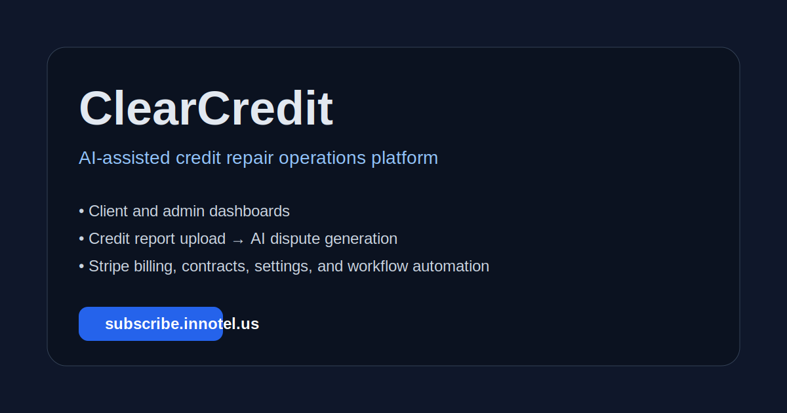

# ClearCredit

[](https://github.com/innotelinc/clearcredit/actions/workflows/ci.yml)
[](https://nextjs.org/)
[](https://www.typescriptlang.org/)
[](https://www.prisma.io/)
[](https://stripe.com/)

AI-assisted credit repair platform built with Next.js, Prisma, NextAuth, and Stripe. ClearCredit gives admins and clients a shared workspace for onboarding, contracts, credit report ingestion, AI-generated disputes, billing, and ongoing case management.



## Live Site
- App: https://subscribe.innotel.us
- Repo: https://github.com/innotelinc/clearcredit

## Core Features
- Multi-step client signup with authorization and contract capture
- Role-based admin and client dashboards
- Credit report upload and AI-assisted dispute generation
- Dispute-credit accounting for packages, subscriptions, and admin adjustments
- Stripe checkout, billing portal, and webhook handling
- Service contracts, invoices, activity logs, and client management
- Admin settings interface, live LLM backend testing, and automation status visibility
- Configurable LLM backends: local Mirrowel proxy, OpenRouter, or direct OpenAI

## Local Setup
```bash
npm install
npx prisma generate
npx prisma db push
npm run seed:admin
npm run dev
```

## Required Environment
```env
DATABASE_URL=file:./dev.db
NEXTAUTH_SECRET=replace-me
NEXTAUTH_URL=http://localhost:3000
PUBLIC_APP_URL=http://localhost:3000
STRIPE_SECRET_KEY=sk_test_...
STRIPE_WEBHOOK_SECRET=whsec_...
RESEND_API_KEY=re_...

# Default local proxy mode
LLM_BACKEND=proxy
LLM_PROXY_BASE_URL=http://127.0.0.1:8000/v1
PROXY_API_KEY=replace-with-random-proxy-key
LLM_PROXY_API_KEY=replace-with-random-proxy-key
LLM_MODEL=openrouter/owl-alpha
LLM_ANALYSIS_MODEL=openrouter/owl-alpha
LLM_LETTER_MODEL=openrouter/owl-alpha
LLM_PROXY_MODEL=openrouter/owl-alpha

# OpenRouter provider credential used behind the proxy
OPENROUTER_API_KEY=sk-or-...

# Optional direct OpenRouter mode
# LLM_BACKEND=openrouter
# OPENROUTER_MODEL=openrouter/owl-alpha
# OPENROUTER_BASE_URL=https://openrouter.ai/api/v1
# OPENROUTER_APP_NAME=ClearCredit

# Optional direct OpenAI mode
# LLM_BACKEND=openai
# OPENAI_API_KEY=sk-...
# OPENAI_MODEL=gpt-4o-mini
# OPENAI_BASE_URL=https://api.openai.com/v1

REPORT_PULL_MODE=mock
AUTO_ANALYZE_PULLED_REPORTS=true
# Generic real-provider mode
# REPORT_PULL_MODE=generic
# REPORT_PROVIDER_BASE_URL=https://provider.example.com
# REPORT_PROVIDER_API_KEY=provider_api_key
# REPORT_PROVIDER_CREATE_PATH=/reports/pull
# REPORT_PROVIDER_STATUS_PATH=/reports/:id
# REPORT_PROVIDER_WEBHOOK_SECRET=shared_secret
```

## Local Mirrowel Proxy Service
ClearCredit now defaults to a local Mirrowel LLM-API-Key-Proxy instance talking to OpenRouter `openrouter/owl-alpha`.

Install the service wrapper files:
```bash
./scripts/install-llm-proxy-service.sh
```

Run the proxy immediately in the foreground:
```bash
./scripts/start-local-llm-proxy.sh
```

If your environment supports a user systemd bus, enable the user service:
```bash
systemctl --user daemon-reload
systemctl --user enable --now clearcredit-llm-proxy.service
```

The installed config file lives at:
```text
~/.config/clearcredit/llm-proxy.env
```

## Mirrowel LLM-API-Key-Proxy Integration
ClearCredit supports Mirrowel's proxy through the standard OpenAI-compatible `/v1/chat/completions` endpoint.

Example proxy-side config:
```env
PROXY_API_KEY=replace-with-random-proxy-key
OPENROUTER_API_KEY_1=sk-or-...
SKIP_OAUTH_INIT_CHECK=true
OPENROUTER_API_BASE=https://openrouter.ai/api/v1
```

## Useful Commands
```bash
npm run lint
npm test
npx tsc --noEmit
npm run build
npm run seed:admin
./scripts/start-local-llm-proxy.sh
```

## Stripe Webhook
Endpoint:
```text
https://subscribe.innotel.us/api/stripe/webhook
```

Subscribe to:
- `checkout.session.completed`
- `invoice.payment_succeeded`
- `invoice.payment_failed`
- `customer.subscription.deleted`

## Automation Notes
- Uploaded credit reports can be analyzed into disputes automatically.
- Automatic report pulling is wired behind `/api/reports/pull`.
- Provider callbacks are handled at `/api/reports/provider-webhook`.
- Admins can trigger a full automation cycle from Settings or `POST /api/automation/run`.
- Admins can run a live LLM health check from Settings via `POST /api/settings/llm-test`.
- LLM-backed analysis and letter generation run through the shared backend adapter in `src/lib/llm.ts`.
- For local/demo automation, set `REPORT_PULL_MODE=mock`.
- For real provider mode, configure the generic provider environment values shown above.

## CI
GitHub Actions validates:
- lint
- tests
- typecheck
- production build

## License
MIT
